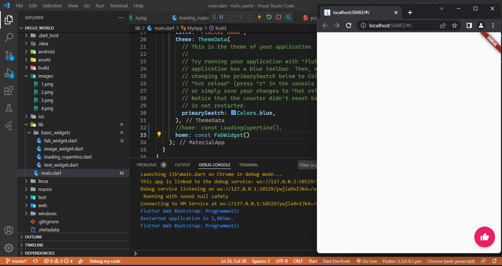
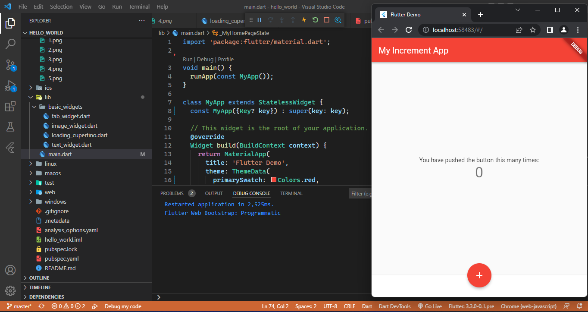
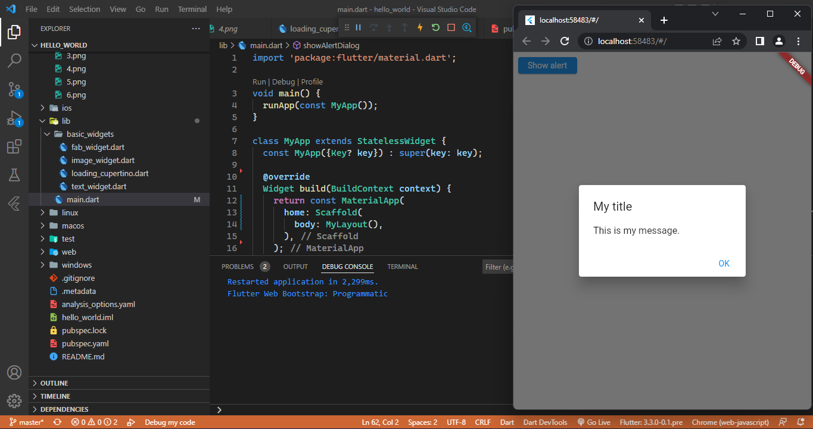
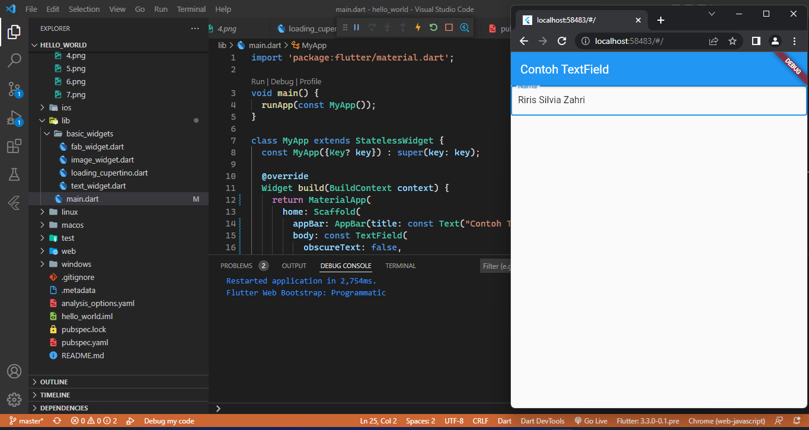
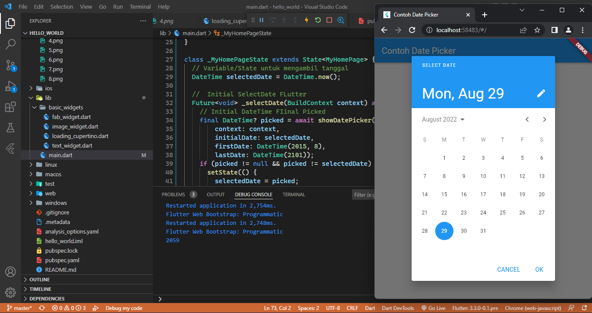
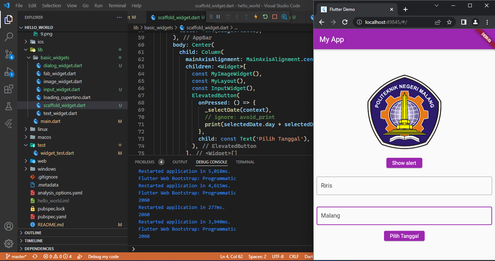

# hello_world

A new Flutter project.
# Tugas 1
## Praktikum 2
Hasil Hello word

## Praktikum 3
Hasil dari Text

Hasil dari image

## Praktikum 4
Langkah 1: Cupertino Button dan Loading Bar

Langkah 2: Floating Action Button (FAB)

Langkah 3: Scaffold Widget

Langkah 4: Dialog Widget

Langkah 5: Input dan Selection Widget

Langkah 6: Date and Time Pickers

# Tugas 2

Pada praktikum 4 mulai dari Langkah 3 sampai 6, buatlah file widget tersendiri di folder basic_widgets, kemudian pada file main.dart cukup melakukan import widget 

